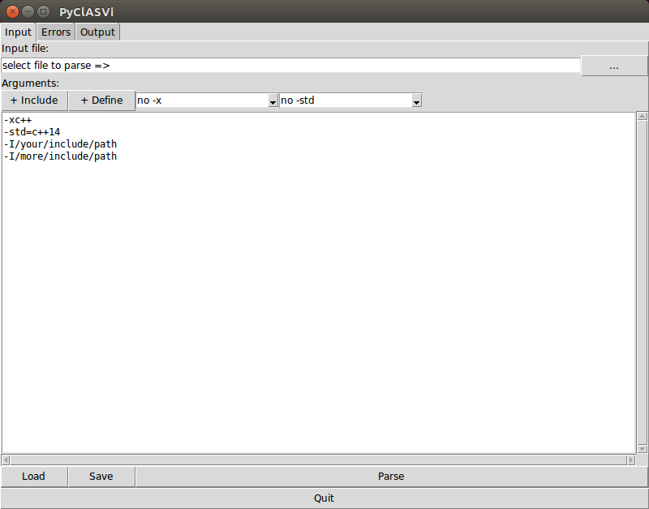
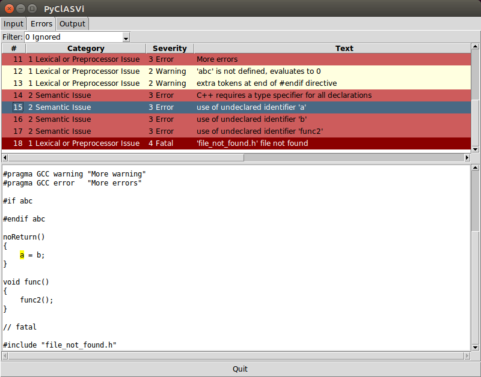
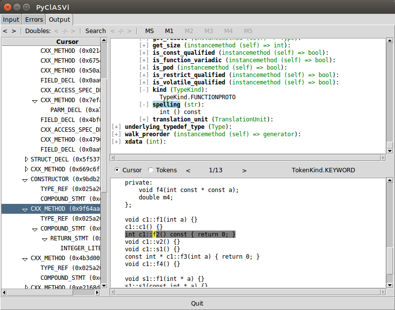

# How to use Python Clang AST Viewer

## Command line

You can call `pyclasvi.py -h` to get the command line help.

    usage: pyclasvi.py [-h] [-l LIBFILE] [file]

    Python Clang AST Viewer

    positional arguments:
    file                  Text file containing input data, 1st line = file to
                            parse, next lines = Clang arguments, one argument per
                            line

    optional arguments:
    -h, --help            show this help message and exit
    -l LIBFILE, --libfile LIBFILE
                            select Clang library file

A typical call may be `./pyclasvi.py /usr/lib/llvm-3.8/lib/libclang.so.1 examples/test_all.txt`.

## Input

After starting PyClASVi you will see the Input tab.

In the first line you can select the file to parse. The lower textbox contains all options for the parser,
one option per line.
You can enter this options by yourself or use the toolbar.

Finally press [parse] to start.

* `Input file`:

  You can enter the file to parse by yourself or use the following button.

* `[...]`

  Select file to parse.

* `[+ Include]`

  Add an include option. A dialog allows you to select an include path.

* `[+ Define]`

  Add a dummy define option. You must edit name and value by yourself.

* `-x`-Combobox

  Add, remove or change the option to specify the language (C/C++).

* `-std`-Combobox

  Add, remove or change the option for language standard/version.

  Normally you do not need a `-x` option if you have a `-std` option.

* `[Load]`

  All inputs you have done here can be restored from a text file.

* `[Save]`

  Save all inputs you have done in a text file.

* `[Parse]`

  Start parsing.
  If there is nothing to parse you will stay in Input tab.
  If errors or warnings occurs while parsing you will go to Error tab.
  If parse work fine you will go to Output tab.

## Errors

If there are some warnings or errors while parsing you will find all diagnostics here.

Click on one diagnostic in the table to see corresponding location (yellow) in source code below.
Only the first occur will be shown.

* `Filter:`

  Select a severity level to filter shown diagnostics.

## Output

After parsing (even with warnings or errors) you can walk through the Abstract Syntax Tree
using the Output tab.

On the left you see the AST. One node is called a cursor. Click at once to see its attributes
on the upper right and its location (yellow) and range (grey) in source code on the lower right.

By default all attributes are folded so you can see only the name, type and a `[+]` in front of it.
Click `[+]` to unfold it an see the attribute value. Click `[-]` to fold it again.
You will see an unfolded attribute stays unfolded even you select an other cursor.
Some attributes have sub attributes so you can also fold and unfold it.

If you are interesting in a special attribute click its name to hight light it.
If you select on other cursor the view is automatically scrolled to this attribute.

* Main toolbar
    * `[<]` `[>]`

        The history buttons allows you to go to last viewed cursors and back.

    * `Doubles:` `[<]` `#/#` `[>]`

      Some cursors exists several times in AST. These buttons are only active for such cursor.
      You can go the others position in AST using the arrow buttons. The label between the buttons
      shows who many doubles there are and witch one you currently have selected.

    * `[Search]` `[<]` `#/#` `[>]`

      Click the `[Search]` button to search for cursors. A new window allows you to enter a search pattern.
      You can search for spelling and the kind of cursor.

      If you want to search only for a kind leave `Spelling` blank and activate `Use RegEx`.

    * `[MS]` `[M1]` .. `[M5]`

      The marker buttons are helpful if you found an interesting cursor. First click `[MS]` (marker store)
      and than one of the other buttons e.g. `[M1]`.
      Now you can browse through the AST and if you want go back to marked cursor just click `[M1]`
      or where ever you have store it.

* Source code toolbar
    * `[Cursor]`

      Click this to see position and hole range of the cursor in source code.

      This is the default after selecting a cursor.

    * `[Tokens]` `[<]` `#/#` `[>]`

      Click `[Tokens]` to show the position and range of a singe token belonging to current cursor.
      One cursor may belong to one or more tokens. The number is shown between the arrow buttons.
      Use this buttons to select on other token.