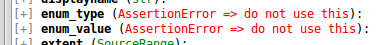

# How to use Python Clang

## Basics

A simple script to parse a file and output the root cursors kind and name (spelling).

```python
import clang.cindex

# use this if libclang could not be found
#libfile = '/usr/lib/llvm-3.8/lib/libclang.so.1'
#clang.cindex.Config.set_library_file(libfile)

index = clang.cindex.Index.create()
filename = 'test_all.cpp'
args=('-std=c++11',)

tu = index.parse(filename, args=args) # args may be omitted if not needed
root = tu.cursor

print(root.kind, root.spelling)
```

Nearly the same.

```python
import clang.cindex

# use this if libclang could not be found
#libfile = '/usr/lib/llvm-3.8/lib/libclang.so.1'
#clang.cindex.Config.set_library_file(libfile)

filename = 'test_all.cpp'
args=('-std=c++11',)

tu = clang.cindex.TranslationUnit.from_source(filename, args=args) # args may be omitted if not needed

root = tu.cursor

print(root.kind, root.spelling)
```

You can also just parse a string.

```python
import clang.cindex

# use this if libclang could not be found
#libfile = '/usr/lib/llvm-3.8/lib/libclang.so.1'
#clang.cindex.Config.set_library_file(libfile)

index = clang.cindex.Index.create()
testcode = (('test.h', 'int a;'),) # iterable of tupels with file name and file context

tu = index.parse('test.h', unsaved_files=testcode)

root = tu.cursor

print(root.kind, root.spelling)
```

The following code snippets can not run by itself. Start with one of the basics code snippets above.

## Browse AST

We have a tree so we want to see the child nodes.

```python
for child in root.get_children():
    print(child.kind, child.spelling)
```

Remark clang will never return a list but something you can iterate.

```python
children = root.get_children()
#print(children[0].spelling) # does not work
children = list(children)
print(children[0].spelling) # works
```

Print the whole AST.

```python
def print_ast(cursor, deep=0):
    print(' '.join((deep*'    ', str(cursor.kind), str(cursor.spelling))))
    for child in cursor.get_children():
        print_ast(child, deep+1)

print_ast(root)
```

If you just need to test all cursors you can use `walk_preorder()`.

```python
for c in root.walk_preorder():
    print(c.kind, c.spelling)
```

You might think every cursor must have a parent cursor without the root of course.
But there are two properties with parent in name: `semantic_parent` and `lexical_parent`.

Try the following code and you will see that you can't always use it to go back to parent in AST.

```python
def check_parents(cursor, root=None):
    sem_root = None
    lex_root = None
    if cursor.semantic_parent is None:
        sem = 'no'
    else:
        sem = 'a'
        if root is not None:
            if cursor.semantic_parent == root:
                sem_root = 'also'
            else:
                sem_root = 'not'
    if cursor.lexical_parent is None:
        lex = 'no'
    else:
        lex = 'a'
        if root is not None:
            if cursor.lexical_parent == root:
                lex_root = 'also'
            else:
                lex_root = 'not'
    print('\nThe Cursor {} of type {} has {} semantic parent and {} lexical parent.'.format(
        cursor.spelling, cursor.kind, sem, lex))
    if (cursor.semantic_parent is not None) and (cursor.lexical_parent is not None):
        if cursor.semantic_parent == cursor.lexical_parent:
            print('Both are the same.')
        else:
            print('They differ.')
    if sem_root:
        print('The semantic parent is {} the parent in AST.'.format(sem_root))
    if lex_root:
        print('The lexical parent is {} the parent in AST.'.format(lex_root))

    for child in cursor.get_children():
        check_parents(child, cursor)

check_parents(root)
```

There is a special feature of the AST with make it impossible to have a general parent property.
Some cursors are several times present in the AST.

```python
testcode = (('test.h',
"""
struct {
    int a;
} s1;
"""),)

tu = index.parse(testcode[0][0], unsaved_files=testcode)

root = tu.cursor

allcursors = list(root.walk_preorder())

for c1 in allcursors:
    count = 0
    for c2 in allcursors:
        if c1 == c2:
            count += 1
    if count > 1:
        print('Found cursor {} {} {} times in AST.'.format(
            c1.spelling, c1.kind, count))
```

## Hints

Sometimes you want to compare two cursors. You can use the compare operator but you must be sure
to compare only equal kind of object or an error will be thrown.
As we see in last section some methods typical returning a cursor
may also return nothing (None).


```python
cmp = root

for c in root.walk_preorder():
    #if c.lexical_parent == cmp: # will throw an error
    if (c.lexical_parent is not None) and (c.lexical_parent == cmp): # works
        print('Cursor {} {} has {} {} as lexical_parent.'.format(
            c.spelling, c.kind, cmp.spelling, cmp.kind))
```

You can not access every attribute for every cursor or its sub attributes.
For example you can not access `enum_type` and `enum_value` from not enum cursors.
In PyClASVi you can see the exceptions you will get.



Also do not try to access every attribute of a `Type` object witch has the kind `TypeKind.INVALID`.
Especially `get_address_space()` may cause a crash not just an exception (tested with libclang 5.0).